# C4 Container Diagram — ProShop MERN

## Use-case: Customer places an order and pays via PayPal

```mermaid
flowchart TD

  %% ── Styles ──────────────────────────────────────────────
  classDef frontend fill:#4285F4,color:#fff,stroke:#1a73e8
  classDef backend  fill:#34A853,color:#fff,stroke:#0d652d
  classDef middleware fill:#7CB342,color:#fff,stroke:#558B2F
  classDef datastore fill:#FB8C00,color:#fff,stroke:#e65100
  classDef external fill:#EA4335,color:#fff,stroke:#b71c1c
  classDef filesystem fill:#FF9800,color:#fff,stroke:#e65100

  %% ── Frontend ────────────────────────────────────────────
  subgraph Frontend ["Frontend — React SPA :3000"]
    APP["frontend/src/App.js<br/><i>Router & layout</i>"]:::frontend
    STORE["frontend/src/store.js<br/><i>Redux store + localStorage hydration</i>"]:::frontend
    ORDER_SCREEN["frontend/src/screens/OrderScreen.js<br/><i>Order detail + PayPal payment</i>"]:::frontend
    PLACEORDER_SCREEN["frontend/src/screens/PlaceOrderScreen.js<br/><i>Order review & submit</i>"]:::frontend
    ORDER_ACTIONS["frontend/src/actions/orderActions.js<br/><i>Order thunk actions (axios)</i>"]:::frontend
    CART_ACTIONS["frontend/src/actions/cartActions.js<br/><i>Cart thunk actions</i>"]:::frontend

    APP --> ORDER_SCREEN
    APP --> PLACEORDER_SCREEN
    ORDER_SCREEN --> ORDER_ACTIONS
    PLACEORDER_SCREEN --> ORDER_ACTIONS
    ORDER_ACTIONS --> STORE
    CART_ACTIONS --> STORE
  end

  %% ── Backend ─────────────────────────────────────────────
  subgraph Backend ["Backend — Express :5000"]
    SERVER["backend/server.js<br/><i>Express entry point</i>"]:::backend
    AUTH_MW["backend/middleware/authMiddleware.js<br/><i>JWT protect & admin guards</i>"]:::middleware
    ERR_MW["backend/middleware/errorMiddleware.js<br/><i>notFound + errorHandler</i>"]:::middleware

    subgraph Routes ["Route layer"]
      ORDER_ROUTES["backend/routes/orderRoutes.js<br/><i>/api/orders</i>"]:::backend
      PRODUCT_ROUTES["backend/routes/productRoutes.js<br/><i>/api/products</i>"]:::backend
      USER_ROUTES["backend/routes/userRoutes.js<br/><i>/api/users</i>"]:::backend
      UPLOAD_ROUTES["backend/routes/uploadRoutes.js<br/><i>/api/upload (multer)</i>"]:::backend
    end

    subgraph Controllers ["Controller layer"]
      ORDER_CTRL["backend/controllers/orderController.js<br/><i>addOrderItems, updateOrderToPaid…</i>"]:::backend
      PRODUCT_CTRL["backend/controllers/productController.js<br/><i>getProducts, createProductReview…</i>"]:::backend
      USER_CTRL["backend/controllers/userController.js<br/><i>authUser, registerUser…</i>"]:::backend
    end

    subgraph Models ["Mongoose models"]
      ORDER_MODEL["backend/models/orderModel.js<br/><i>Order schema</i>"]:::backend
      PRODUCT_MODEL["backend/models/productModel.js<br/><i>Product + Review schema</i>"]:::backend
      USER_MODEL["backend/models/userModel.js<br/><i>User schema + bcrypt hooks</i>"]:::backend
    end

    JWT_UTIL["backend/utils/generateToken.js<br/><i>jwt.sign (30d expiry)</i>"]:::backend
    DB_CONFIG["backend/config/db.js<br/><i>mongoose.connect</i>"]:::backend

    SERVER --> ORDER_ROUTES
    SERVER --> PRODUCT_ROUTES
    SERVER --> USER_ROUTES
    SERVER --> UPLOAD_ROUTES
    SERVER --> ERR_MW

    ORDER_ROUTES --> AUTH_MW
    ORDER_ROUTES --> ORDER_CTRL
    PRODUCT_ROUTES --> AUTH_MW
    PRODUCT_ROUTES --> PRODUCT_CTRL
    USER_ROUTES --> AUTH_MW
    USER_ROUTES --> USER_CTRL

    ORDER_CTRL --> ORDER_MODEL
    PRODUCT_CTRL --> PRODUCT_MODEL
    USER_CTRL --> USER_MODEL
    USER_CTRL --> JWT_UTIL
    AUTH_MW --> USER_MODEL
  end

  %% ── Data Layer ──────────────────────────────────────────
  subgraph DataLayer ["Data Layer"]
    MONGO[("MongoDB<br/><i>via Mongoose ^5.10</i>")]:::datastore
    UPLOADS[("uploads/<br/><i>Local filesystem</i>")]:::filesystem
    LOCALSTORAGE[("localStorage<br/><i>cartItems, userInfo,<br/>shippingAddress</i>")]:::datastore
  end

  %% ── External ───────────────────────────────────────────
  subgraph External ["External Services"]
    PAYPAL_SDK["PayPal JS SDK<br/><i>https://www.paypal.com/sdk/js</i>"]:::external
    PAYPAL_API["PayPal Payments API<br/><i>Sandbox / Live</i>"]:::external
  end

  %% ── Static connections ─────────────────────────────────
  DB_CONFIG -- "mongoose.connect(MONGO_URI)" --> MONGO
  ORDER_MODEL -- "Mongoose CRUD" --> MONGO
  PRODUCT_MODEL -- "Mongoose CRUD" --> MONGO
  USER_MODEL -- "Mongoose CRUD" --> MONGO
  UPLOAD_ROUTES -- "multer.diskStorage" --> UPLOADS
  STORE -- "JSON.parse / setItem" --> LOCALSTORAGE

  %% ── Use-case flow: Place Order & Pay ───────────────────
  %% Numbered arrows trace the concrete data flow

  PLACEORDER_SCREEN -. "1 — dispatch(createOrder)" .-> ORDER_ACTIONS
  ORDER_ACTIONS -. "2 — POST /api/orders<br/>Authorization: Bearer token" .-> ORDER_ROUTES
  ORDER_CTRL -. "3 — new Order(…).save()" .-> MONGO

  ORDER_SCREEN -. "4 — GET /api/config/paypal" .-> SERVER
  ORDER_SCREEN -. "5 — load PayPal SDK script" .-> PAYPAL_SDK
  PAYPAL_SDK -. "6 — buyer approves payment" .-> PAYPAL_API
  PAYPAL_API -. "7 — paymentResult callback" .-> ORDER_SCREEN
  ORDER_SCREEN -. "8 — dispatch(payOrder)" .-> ORDER_ACTIONS
  ORDER_ACTIONS -. "9 — PUT /api/orders/:id/pay<br/>Authorization: Bearer token" .-> ORDER_ROUTES
  ORDER_CTRL -. "10 — order.save({isPaid:true})" .-> MONGO
```

## Files inspected

| File                                       | Purpose                                               |
|--------------------------------------------|-------------------------------------------------------|
| `package.json`                             | Root deps, scripts, module type                       |
| `frontend/package.json`                    | Frontend deps, proxy config                           |
| `backend/server.js`                        | Express setup, route mounting, PayPal config endpoint |
| `backend/config/db.js`                     | Mongoose connection                                   |
| `backend/routes/orderRoutes.js`            | Order REST routes + middleware chain                  |
| `backend/routes/productRoutes.js`          | Product REST routes                                   |
| `backend/routes/userRoutes.js`             | User/auth REST routes                                 |
| `backend/routes/uploadRoutes.js`           | Multer file upload                                    |
| `backend/controllers/orderController.js`   | Order handlers (addOrderItems, updateOrderToPaid)     |
| `backend/controllers/productController.js` | Product handlers                                      |
| `backend/controllers/userController.js`    | User/auth handlers                                    |
| `backend/middleware/authMiddleware.js`     | JWT protect + admin guard                             |
| `backend/middleware/errorMiddleware.js`    | Global error handler                                  |
| `backend/models/orderModel.js`             | Order Mongoose schema                                 |
| `backend/models/productModel.js`           | Product Mongoose schema                               |
| `backend/models/userModel.js`              | User Mongoose schema + bcrypt                         |
| `backend/utils/generateToken.js`           | JWT sign helper                                       |
| `frontend/src/App.js`                      | React Router routes                                   |
| `frontend/src/store.js`                    | Redux store + localStorage hydration                  |
| `frontend/src/screens/OrderScreen.js`      | PayPal SDK loading + payment flow                     |
| `frontend/src/screens/PlaceOrderScreen.js` | Order submission                                      |
| `frontend/src/actions/orderActions.js`     | Axios calls to /api/orders                            |

## Unverified / needs review

- **PayPal webhook**: The codebase has no server-side PayPal webhook handler. Payment verification relies entirely on the client-side `PayPalButton` callback posting `paymentResult` to `PUT /api/orders/:id/pay`. There is no server-side signature verification of the PayPal response — the backend trusts whatever the client sends.
- **CORS**: No `cors` middleware is installed or configured. In development the CRA proxy handles cross-origin; production serves everything from Express. If the frontend is ever deployed separately, CORS will need to be added.
- **Rate limiting / helmet**: Not present in the codebase. Not shown in the diagram.
